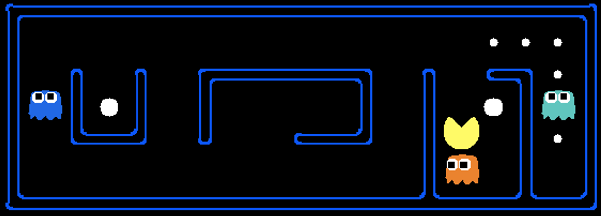
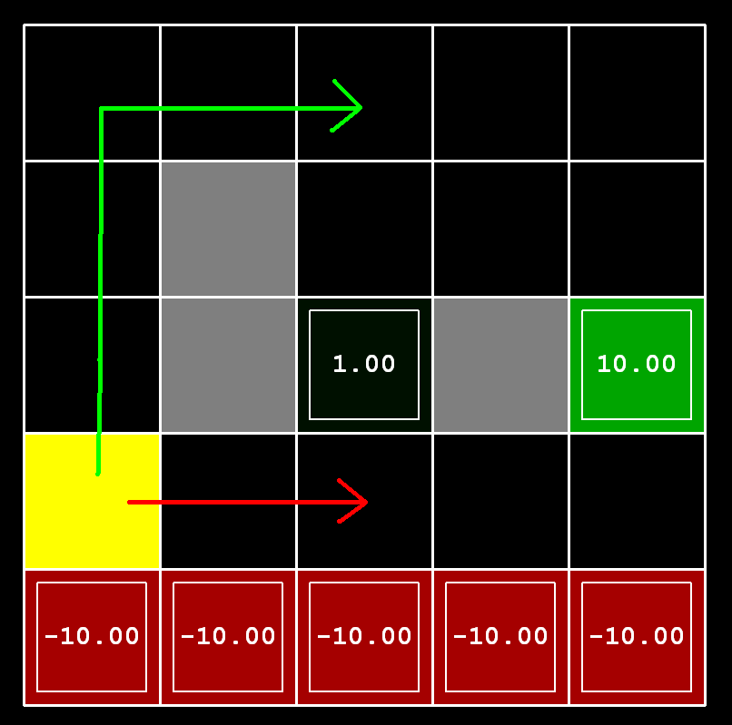

# 吃豆人-强化学习
## Contents
{: .no_toc .text-delta }

1. TOC
{:toc}
---

## 1.实验背景

随着人工智能和机器学习技术的迅速发展，强化学习（Reinforcement Learning）作为一种重要的学习范式，在解决现实世界中复杂问题方面取得了显著的成果。强化学习通过智能体（agent）与环境（environment）的交互，通过学习合适的动作来最大化累积奖励，是人工智能领域中的热门研究方向之一。

路径规划是强化学习在实际应用中的一个典型场景，尤其在无人驾驶、机器人导航、游戏AI等领域具有重要意义。在这些应用中，智能体需要在复杂的环境中找到最优路径，以便高效地到达目的地。传统的路径规划算法面临着环境复杂性增加时计算复杂度急剧上升的问题，而强化学习算法能够通过与环境的交互学习到适应不同环境的最优路径，具有很好的适应性和泛化能力。

本实验基于经典的吃豆人（Pacman）游戏，逐步实现强化学习核心算法，从基础的值迭代，到更高级的Q-Learning和近似Q-Learning，最终目标是让智能体在吃豆人游戏中中自主学习最优策略。通过对参数的调整和理解算法原理，掌握让智能体找到最优动作的方法。


---

## 2.实验要求

（1）掌握强化学习中的值迭代算法、Q-Learning和近似Q-Learning算法

（2）掌握强化学习中的策略，学会设计策略

（3）需要补全给的示例代码，并提交完整代码，代码中需要有必要的中文注释

（4）理解并熟悉提供的代码结构和实现逻辑

---

## 3.实验内容

### 3.1 值迭代算法（Value Iteration）

理解马尔可夫决策过程和贝尔曼方程，并在valueIterationAgents.py文件中编写值迭代算法，让智能体通过反复计算每个状态的价值，找到最优的行动策略。通过不断更新每个位置的价值，直到这些价值稳定下来（例如，计算100次），最后根据价值选择最佳路径。利用公式反复计算，确保每一步都基于前一步的结果。

在提供的参考代码中，可以看到一个网格世界，智能体回根据计算出来的价值自动导航到出口。

值迭代状态更新公式：

 <script type="text/javascript" src="http://cdn.mathjax.org/mathjax/latest/MathJax.js?config=AM_HTMLorMML-full"></script>`V_{k+1}(s) \leftarrow \max_a \sum_{s'} T(s, a, s') [R(s, a, s') + \gamma V_k(s')]`

操作命令：

（1）测试算法算法正确性：

```bash
python autograder.py -q q1
```

（2）可视化价值迭代结果

采用下面的命令加载ValueIterationAgent中的代码，计算策略并执行10次。

```bash
python gridworld.py -a value -i 100 -k 10
```

（3）快速查看5次迭代后价值（示例输出）

```bash
python gridworld.py -a value -i 5
```

---

### 3.2 策略（Policies）

在一个有“悬崖”和出口的网格中，如下图所示，红色部分为悬崖，绿色为出口，黄色为起始位置，格子中的数值为智能体的回报。有两种类型的路径选择：（1）冒着悬崖的风险，在网格的底线附近行走，路径较短，但是有产生巨额负回报的风险，这些路径由下图中的红色箭头表示；（2）避免悬崖并沿着网格顶端边缘行走，路径更长，但不太可能产生巨大的负回报，这些路径由下图中的绿色箭头表示。



在这个问题中，有三个参数可以调整，为MDP设置折扣因子、噪声和生存奖励，以产生几种不同类型的最佳策略，如果对于任何参数设置都无法实现特定行为，请返回字符串“NOT POSSIBLE”。

下面是可以尝试制定的最佳策略类型：

（1）偏好近出口（+1），冒险进入悬崖（-10）

（2）偏好近出口（+1），但避免悬崖（-10）

（3）偏好远出口（+10），冒险进入悬崖（-10）

（4）偏好远出口（+10），避免悬崖（-10）

（5）避免两个出口和悬崖（即一个回合永远不应终止）

---

### 3.3 Q-Learning

实现一个Q-Learning智能体，该智能体通过与环境的交互，利用试错方法学习最优策略。与值迭代智能体不同，Q-Learning智能体在构造时几乎不进行任何初始化，而是在与环境交互的过程中通过update(state, action, nextState, reward)方法进行学习。

在qlearningAgents.py中实现QLearningAgent类。

操作命令：

(1) 手动控制

```bash
python gridworld.py -a q -k 5 -m
```

(2) 自动评分

```bash
python autograder.py -q q3
```

---

### 3.4	利用Q-Learning玩吃豆人

让吃豆人游戏通过Q学习算法在两个阶段中进行游戏：训练阶段和测试阶段。在训练阶段，吃豆人游戏将学习不同位置和动作的价值；在测试阶段，吃豆人游戏将利用其学习到的策略进行游戏。

第一阶段是训练，吃豆人将开始学习位置和动作的价值。由于对于非常小的网格，学习准确的Q值也需要很长时间，因此吃豆人的训练游戏默认在静默模式下运行，没有GUI（或控制台）显示。

一旦训练完成，吃豆人将进入测试模式。在此模式下，吃豆人的self.epsilon和self.alpha将被设置为0.0，这有效地停止了Q学习并禁用了探索，使吃豆人能够利用其学习到的策略。

操作指令：

（1）  训练和测试

```bash
python pacman.py -P PacmanQAgent -x 2000 -n 2010 -l smallGrid
```

（2） 观察少量训练过程

```bash
python pacman.py -p PacmanQAgent -n 10 -l smallGrid -a numTraining=10
```

（3） 自动评分

```bash
python autograder.py -q q5
```

---

###  3.5 近似Q-Learning

实现一个近似Q-learning（Approximate Q-learning）智能体，该智能体通过学习状态-动作特征的权重来估算Q值。这种方法适用于状态空间较大的情况，因为许多状态可能共享相同的特征，而不需要为每个状态单独存储Q值。

实现ApproximateQAgent类，该类是PacmanQAgent的子类，支持基于特征的Q值估计。

使用featureExtractors.py提供的特征提取函数，从状态-动作对(s, a)中提取特征值。

采用线性函数逼近Q值：

$$
\begin{equation}
Q(s, a) = \sum_{i=1}^{n} f_i(s, a) w_i
\end{equation}
$$

其中，$$f_i(s, a)$$是特征值，$$w_i$$是对应的权重。采用类似标准Q-Learning 的方式更新权重：

$$ w_i \leftarrow w_i + \alpha \cdot \text{difference} \cdot f_i(s, a) $$

其中：$$ \text{difference} = (r + \gamma \max_{a'} Q(s', a')) - Q(s, a) $$

这个公式中的difference项与普通Q-learning的更新方式一致。

操作命令：

（1）  测试ApproximateQAgent的正确性：

```bash
python pacman.py -p ApproximateQAgent -x 2000 -n 2010 -l smallGrid
```

（2）  运行自定义特征提取器SimpleExtractor，测试智能体在更大地图上的学习效果：

```bash
python pacman.py -p ApproximateQAgent -a extractor=SimpleExtractor -x 50 -n 60 -l mediumGrid
```

（3）  训练后，智能体应能在较大地图mediumClassic上表现出色：

```bash
python pacman.py -p ApproximateQAgent -a extractor=SimpleExtractor -x 50 -n 60 -l mediumClassic
```

（4）  自动评分：

```bash
python autograder.py -q q6
```

---


## 4.参考资料
（1）Reinforcement Learning: An Introduction：[https://web.archive.org/web/20230417150626/https://web.stanford.edu/class/psych209/Readings/SuttonBartoIPRLBook2ndEd.pdf](https://web.archive.org/web/20230417150626/https://web.stanford.edu/class/psych209/Readings/SuttonBartoIPRLBook2ndEd.pdf)

（2）马尔可夫决策过程：[马尔可夫决策过程](https://hrl.boyuai.com/chapter/1/马尔可夫决策过程/)

（3）Q-Learning算法详解（CSDN）：[【强化学习】Q-Learning算法详解_qlearning算法详解-CSDN博客](https://blog.csdn.net/qq_30615903/article/details/80739243)


