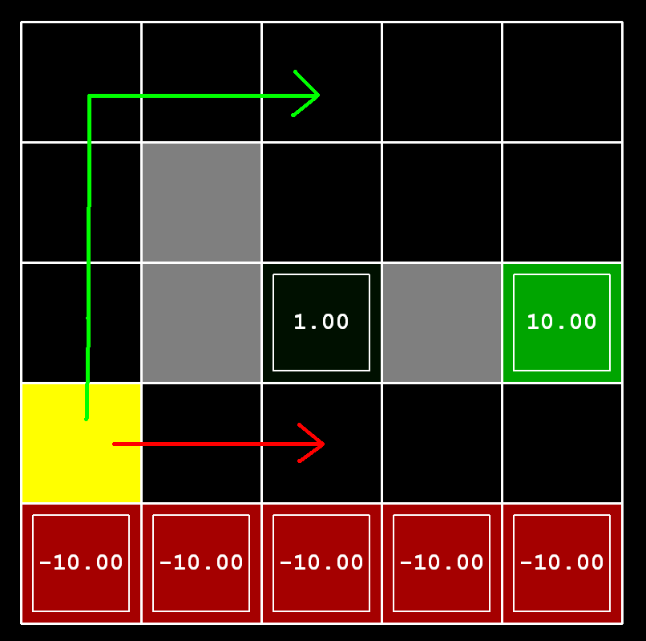

# 2.策略（Policies）

在一个有“悬崖”和出口的网格中，如下图所示，红色部分为悬崖，绿色为出口，黄色为起始位置，格子中的数值为智能体的回报。有两种类型的路径选择：（1）冒着悬崖的风险，在网格的底线附近行走，路径较短，但是有产生巨额负回报的风险，这些路径由下图中的红色箭头表示；（2）避免悬崖并沿着网格顶端边缘行走，路径更长，但不太可能产生巨大的负回报，这些路径由下图中的绿色箭头表示。

在这个问题中，有三个参数可以调整，为MDP设置折扣因子、噪声和生存奖励，以产生几种不同类型的最佳策略，如果对于任何参数设置都无法实现特定行为，请返回字符串“NOT POSSIBLE”。

下面是可以尝试制定的最佳策略类型：

（1）偏好近出口（+1），冒险进入悬崖（-10）

（2）偏好近出口（+1），但避免悬崖（-10）

（3）偏好远出口（+10），冒险进入悬崖（-10）

（4）偏好远出口（+10），避免悬崖（-10）

（5）避免两个出口和悬崖（即一个回合永远不应终止）