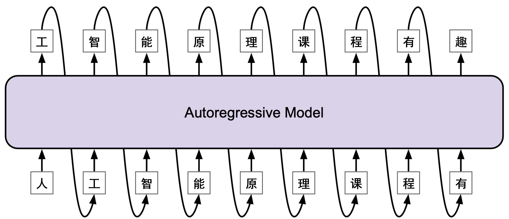
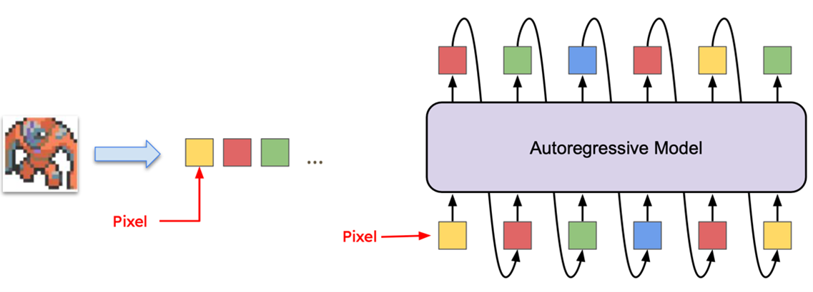
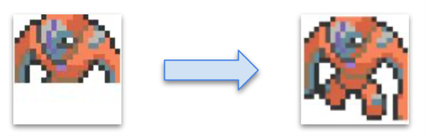
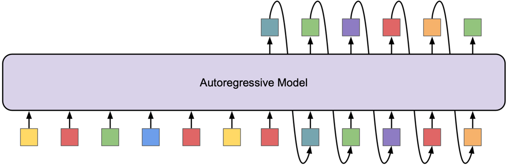
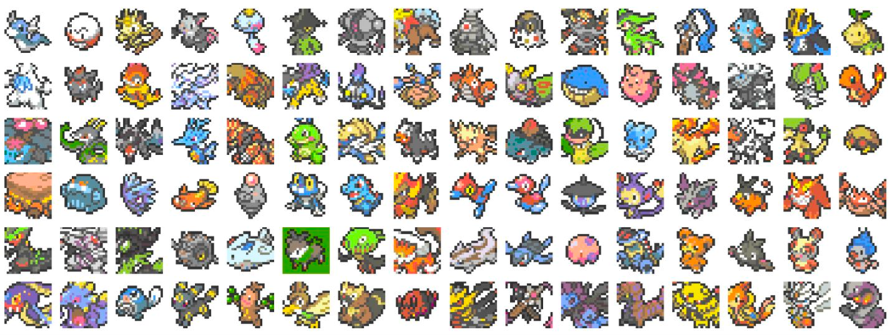
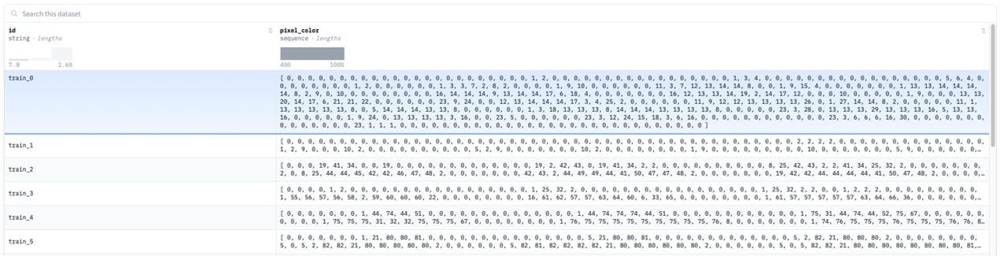
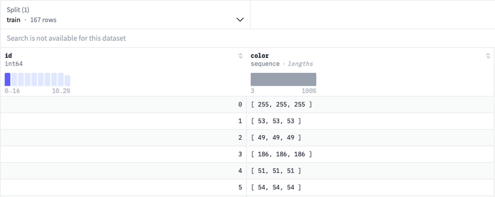

# 2.Transformer模型训练
## 2.1实验描述
  该实验仅使用transformer解码器的模型进行训练，实现Pokémon图像的下一个token预测。
  下一个token预测是语言简模型的一个基本概念，根据前面上下文预测序列中最有可能出现的下一个单词或者token。

图2.1 下一个token预测
 

实验需要训练模型预测Pokémon图像的下一个token。在测试集中，给出图像的60%部分，预测剩余的部分。

图2.2 Pokémon图像下一个token预测

图2.3 测试集示例

图2.4 Pokémon图像下一个token预测模型结构

## 2.2实验数据

  实验数据包含792张Pokémon的图像片20×20），每张图片有400个数字，每个数字代表一种颜色。训练集632张，验证集80张，测试集80张。有167种不同的像素颜色的像素种类。

图2.5 Pokémon图片

图2.6 数据展示

图2.7 每张图片的RGB

## 2.3实验内容

1.	Transformer解码器预测token
使用Pokémon图像和提供的代码构建一个仅使用transformer解码器的模型（transformer decoder-only model），用于预测下一个token。
2.	参数调整
修改给定代码中的模型配置的超参数，调整给定代码中的epoch和学习率，找到模型的最佳参数组合，模型参数调整可以选用合适的方法寻找参数组合。
3.	不同模型架构
除了示例代码给的GPT-2模型架构以为，实验还需要使用Qwen2、Llama和Mistral三种仅使用transformer解码器的模型架构进行实验，根据参考资料给的配置配置其参数，并完成Pokémon图像的预测。

## 2.4实验要求
1.	掌握使用当前的语言模型预测下一个token
2.	理解transformer结构在图像中的应用
3.	完成实验内容中的三个要求，并撰写实验报告和提交Jupyter格式的代码

## 2.5参考资料
1.	Qwen2Config：[https://huggingface.co/docs/transformers/model_doc/qwen2 - transformers.Qwen2Config](https://huggingface.co/docs/transformers/model_doc/qwen2#transformers.Qwen2Config)
2.	LlamaConfig：[https://huggingface.co/docs/transformers/model_doc/llama - transformers.LlamaConfig](https://huggingface.co/docs/transformers/model_doc/llama#transformers.LlamaConfig)
3.	MistralConfig：[https://huggingface.co/docs/transformers/model_doc/mistral - transformers.MistralConfig](https://huggingface.co/docs/transformers/model_doc/llama#transformers.LlamaConfig)

  

  

