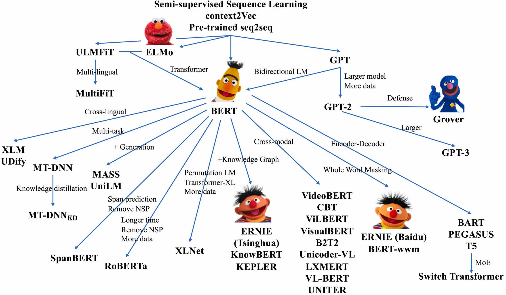
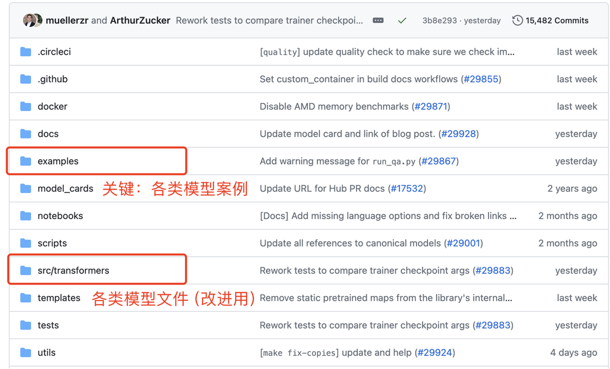

# 预训练模型微调与部署
## Contents
{: .no_toc .text-delta }

1. TOC
{:toc}

## 1.实验背景

随着大规模预训练语言模型（PLMs）在自然语言（NLP）处理领域的广泛应用，基于预训练模型进行下游任务的微调已成为提升模型性能的主要方式。相比于从零开始训练模型，微调不仅节省计算资源，还能在特定任务上取得更优秀的效果。

图1.1 预训练模型和多模态模型家族
 

本实验旨在帮助学生深入理解预训练模型的微调过程，从模型的加载、任务适配、训练优化，到最终的推理部署。学生将学会如何选择合适的预训练模型（如BERT、RoBERTa、T5等），并通过Hugging Face的Transformers工具包完成特定的任务（如文本分类、情感分析、问答系统等）上的微调。同时，还将学会如何使用Gradio构建交互式界面，将模型封装为可复用的Web应用，提升人工智能要应用的实战能力。

## 2. 实验内容

1. 文本分类任务微调（虚假新闻检测）

   了解Transformers代码库中的文本分类案例，使用Hugging Face Transformers 工具包完成预训练模型的加载与微调。实验过程包括：选定数据集、调用tokenizer进行文本编码、设置训练参数并启动模型训练，最后在验证集上评估模型性能。可自由选择如BERT、RoBERTa等不同结构的预训练模型，并观察其在任务表现上的差异。
图1.2 Hugging Face Transformers工具包代码仓库
 
   

2. 模型部署

   在完成微调后，通过Gradio 构建一个简单的Web界面，实现用户输入文本后实时输出模型预测结果的功能。最终，需将模型和交互界面部署到Hugging Face Spaces，形成一个完整的、可在线访问的模型Demo。实验报告需展示模型训练过程、性能评估结果和部署截图。

3. 其他分类/回归任务

   选用合适的预训练模型，实现对情感分类（IMDB数据）、新闻分类（AG News数据）等这两个任务的微调，并比较不同模型在这两个分类任务中的效果。

## 3 .实验要求

1. 理解预训练语言模型（如BERT、RoBERTa、T5等）的基本结构和原理

2. 掌握微调（Fine-tuning）的基本流程，包括数据处理、模型加载、训练与评估

3. 能够使用Hugging Face Transformers工具加载并微调预训练模型完成指定任务

4. 能够基于Gradio搭建简单的模型交互界面，并成功部署在Hugging Face Spaces

5. 提交包含核心代码、运行截图和结果分析的实验报告，要求内容清晰、逻辑完整

6. 使用Python语言

## 4 .参考资料及数据模型下载地址

**参考资料**

1. Transformers工具包（英文）：[huggingface/transformers: 🤗 Transformers: State-of-the-art Machine Learning for Pytorch, TensorFlow, and JAX.](https://github.com/huggingface/transformers)

2. Transformers详细中文文档：[🤗 Transformers简介](https://huggingface.co/docs/transformers/main/zh/index)

3. Gradio教程：[Quickstart](https://www.gradio.app/guides/quickstart)

4. Gradio Sapces教程：[Gradio Spaces](https://huggingface.co/docs/hub/en/spaces-sdks-gradio)

**数据模型下载地址**

1. Bert-base-uncased：[google-bert/bert-base-uncased · Hugging Face](https://huggingface.co/google-bert/bert-base-uncased)

2. Kaggle上虚假推文数据集：[Natural Language Processing with Disaster Tweets Kaggle](https://www.kaggle.com/c/nlp-getting-started/data)

3. IMDB数据：[Sentiment Analysis](http://ai.stanford.edu/~amaas/data/sentiment/)

4. AG News数据：[AG News Classification Dataset](https://www.kaggle.com/datasets/amananandrai/ag-news-classification-dataset/data)

5. Evaluate包：[huggingface/evaluate: 🤗 Evaluate: A library for easily evaluating machine learning models and datasets.](https://github.com/huggingface/evaluate/tree/main)