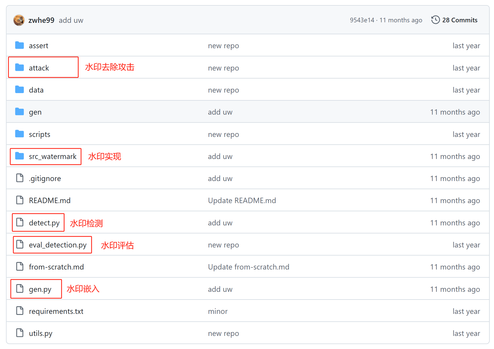
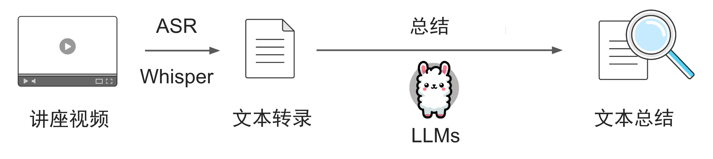
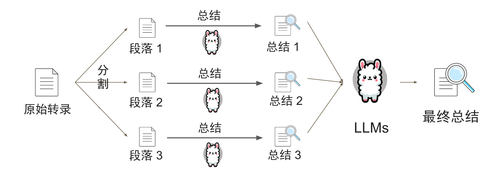
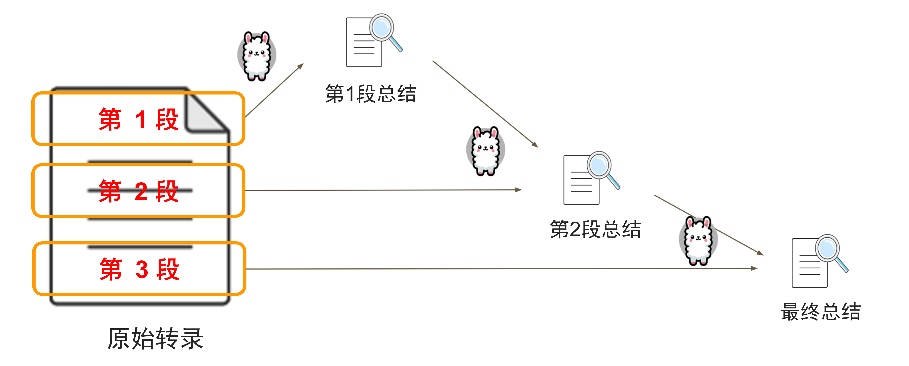

# Contents
{: .no_toc .text-delta }

1. TOC

{:toc}

# **本节实验选择其中一项完成即可**

---

# （选择1）大语言模型水印检测

## 1.1    实验背景

随着大规模预训练语言模型（LLMs）的广泛应用，模型的知识产权保护、输出内容可追溯性等问题愈发突出。因此，训练完成的模型称为了一种昂贵的数字资产，如何从技术角度保护模型的知识产权变得极其重要。为了解决这一挑战，模型水印（Watermarking）技术应运而生，作为一种有效的技术手段，可以嵌入特定的标识信息，防止模型的滥用、盗用或未授权的使用。通过模型水印技术，模型的输出结果可以被追踪和验证，从而增加模型的可控性和可靠性。

本实验通对向模型的生成文本中嵌入隐性水印，帮助理解水印如何嵌入到自然语言生成中，以及如何验证水印的有效性和如何应对模型滥用等问题。

## 1.2    实验内容

1. 模型水印实现（kgw算法）

   本实验以X-SIR代码仓库为基础，使用Hugging Face Transformers工具加载开源大语言模型（如LLaMa3、ChatGLM3等），采用kgw算法对给定的文本生成任务数据（该数据实验会提供）进行水印嵌入、水印检测和水印评估，其中水印评估需要画出ROC曲线。

图6.1 X-SIR代码仓库
 

2. 模型水印鲁棒性实验

   水印去除攻击的方法有两种，分别为paraphrase和translation，在评估水印的鲁棒性实验中，可以对水印文本进行paraphrase和translation攻击后，评估其检测效果。

3. 不同开源模型

   对比不同大语言模型（实验会提供，不需要单独下载）下水印检测的准确度，并评估在不同大语言模型中的水印效果。

4. 三种水印算法评估

   比较X-SIR方法中三种不同算法（kgw，x-sir，sir），评估其在不同攻击方法下的性能，以及三种算法水印检测效果。 

## 1.3    实验要求

1. 掌握Hugging Face Transformers工具包加载大语言模型（如ChatGML、LLaMa等）

2. 熟悉基本的自然语言生成，能够利用现有的工具包实现水印嵌入、检测和评估

3. 能够评估水印的鲁棒性

4.   测试不同开源大语言模型的水印效果和准确度

5.   评估X-SIR模型水印库中X-SIR和SIR两种算法在不同攻击方法下的性能

6.   使用Python语言

## 1.4    参考资料及数据模型下载地址

**参考资料**

1. X-SIR代码仓库：[zwhe99/X-SIR: [ACL 2024\] Can Watermarks Survive Translation? On the Cross-lingual Consistency of Text Watermark for Large Language Models](https://github.com/zwhe99/X-SIR)

2.   ROC曲线详解：[https://zhuanlan.zhihu.com/p/662478145](https://zhuanlan.zhihu.com/p/662478145)

3.   X-SIR模型水印论文：[[2402.14007\] Can Watermarks Survive Translation? On the Cross-lingual Consistency of Text Watermark for Large Language Models](https://arxiv.org/abs/2402.14007)

4. Google SynthID模型水印：[SynthID - Google DeepMind](https://deepmind.google/technologies/synthid/)

5.   Google SynthID模型水印论文：[Scalable watermarking for identifying large language model outputs | Nature](https://www.nature.com/articles/s41586-024-08025-4)

---

# （选择2）讲座视频摘要

## 1.1    实验背景

随着多模态人工智能的发展，如何高效处理和理解视频的内容成为重要的课题。大量公开课程、讲座和会议录音包含丰富的知识，但其冗长的内容给信息获取带来了诸多不便。

本实验结合自动语音识别（ASR）和大语言模型（LLMs），实现从视频到摘要/总结的全过程，体会人工智能如何提升内容获取的效率。

图6.2 讲座视频摘要流程
 

## 1.2    实验内容

1. 自动语音识别

   使用OpenAI的Whisper模型对给定的讲座视频进行语音识别，获取视频的文本信息

2. 文本摘要

   构建自己的大语言模型prompt，将文本摘要为300-500字，摘要结果为中文。

3. 两种摘要方法

   将未处理的文本直接出入到大语言模型中，让大语言模型直接对全文进行摘要。但是这种直接摘要的方法存在一定的问题，由于大语言模型输入token长度的限制，如果文本太长，大语言模型无法一次性处理所有的文本。所以在该实验中可以采用以下两种方法：（1）多阶段摘要；（2）递进式摘要。
图6.3 多阶段摘要
 
图6.4 递进式摘要
 

4. 多种prompt效果比较

   该实验重点在于构建prompt，构建不同的prompt获得不同的摘要效果，比较不同prompt下摘要的优劣，并对prompt进行优化。

5. 摘要评估

   自行利用设计prompt，利用大语言模型评估摘要的质量，获得评分（0-100分）。

**注：自行设计的评估prompt作为报告的一部分，其评估分数也是报告的一部分。**

## 1.3    实验要求

1. 了解自动语音识别（ASR）原理，学会使用OpenAI Whisper实现转写

2. 学会写大语言模型prompt，针对特定的问题构建特定的prompt

3. 需要提交实验报告、生成的摘要（.txt格式）、转写文本（.txt格式）、摘要的方法选择说明、生成摘要的prompt、评估prompt

4. 使用Python语言

## 1.4    参考资料

1. Whisper：[openai/whisper: Robust Speech Recognition via Large-Scale Weak Supervision](https://github.com/openai/whisper)

2. 摘要评价参考论文：[[2305.17529\] MeetingBank: A Benchmark Dataset for Meeting Summarization](https://arxiv.org/abs/2305.17529)

3. 文本摘要LangChain代码：[generative-ai/language/use-cases/document-summarization/summarization_large_documents_langchain.ipynb at main · GoogleCloudPlatform/generative-ai](https://github.com/GoogleCloudPlatform/generative-ai/blob/main/language/use-cases/document-summarization/summarization_large_documents_langchain.ipynb)

 
